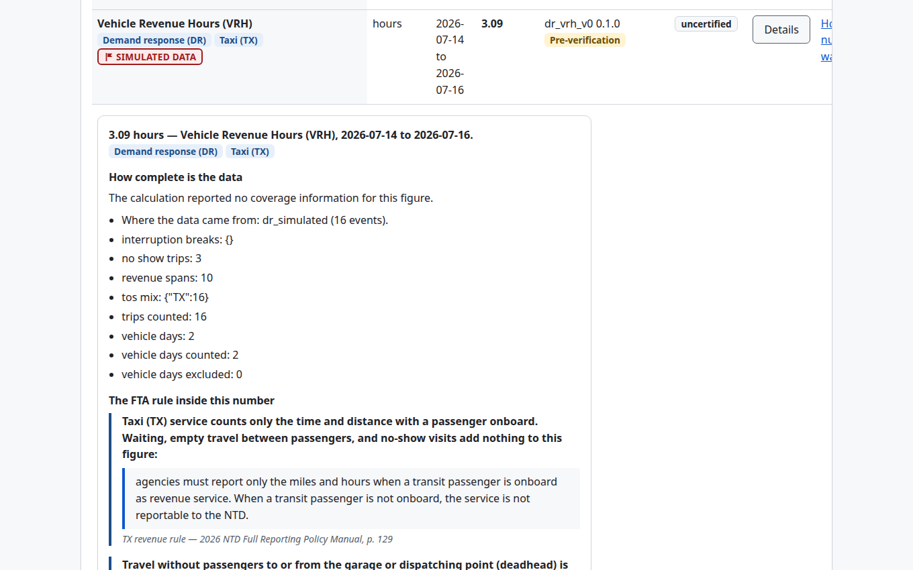
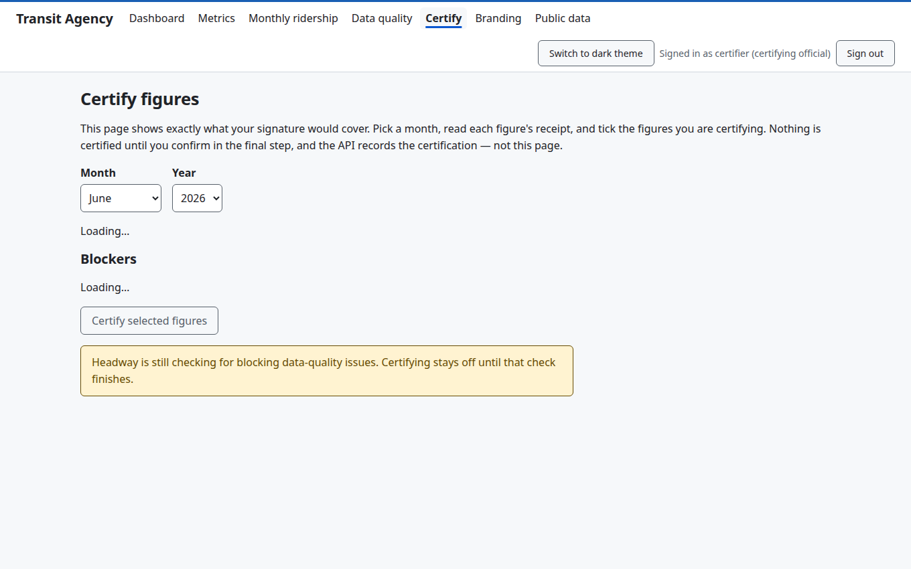
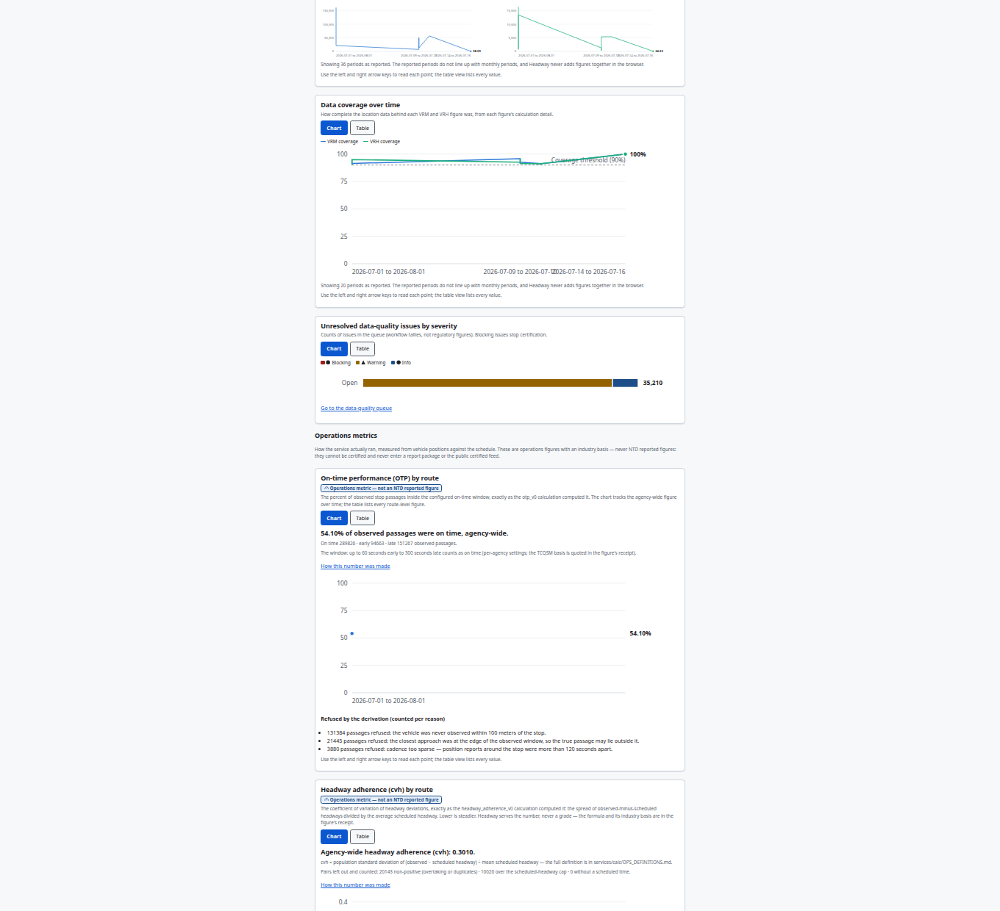
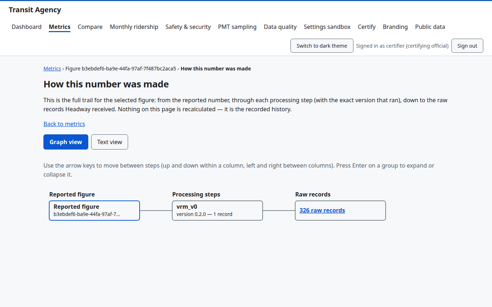

<div align="center">

# 🚌 Headway

**The open-source transit data platform where every number can prove itself.**

[](https://github.com/headway-transit/headway/actions/workflows/ci.yml)
[](LICENSE)
[](https://github.com/headway-transit/headway/releases)

</div>

Headway ingests a transit agency's operational data — GTFS and GTFS-Realtime feeds, TIDES passenger counts, and more — into an immutable, replayable log, normalizes it into one open canonical model, and computes the figures agencies report to the FTA's **National Transit Database**: vehicle revenue miles and hours, unlinked passenger trips, vehicles operated in maximum service.

What makes it different is one design decision applied everywhere: **radical provenance.**

- Every reported figure is computed by **deterministic, versioned, unit-tested calculation logic** — with the federal regulation it implements *quoted, page-cited, and displayed inside the number*.
- Every figure can be **walked back through an explicit lineage graph** to the content-addressed raw records that produced it.
- Data gaps are never papered over: the platform **refuses to report over unresolved gaps**, and every exclusion becomes an owned, documented data-quality issue — because an unexplained gap becomes a finding in an FTA triennial review.
- AI features assist (anomaly flags, triage, drafting) but **AI never computes a reported number**; every AI output cites its sources, is labeled, and requires human review — enforced by types and a CI grounding gate, not by policy documents.
- Certification is **informed consent, mechanized**: the signing screen shows exactly what a signature covers, and won't arm while blocking issues are open or simulated data is unacknowledged.

## See it

| The Receipt — regulation inside the number | The certification cockpit |
| --- | --- |
|  |  |

| Dashboards (colorblind-validated palettes) | The lineage walk |
| --- | --- |
|  |  |

## Quickstart

On a fresh Linux box, run the guided installer:

```sh
./install/install.sh
```

It checks the machine, generates strong secrets, brings the stack up, applies migrations, and creates your first administrator — explaining every step and every failure in plain language (`--check` for a no-changes dry run; [full guide](install/README.md)). Sizing a box or VM first? [`docs/sizing.md`](docs/sizing.md) has measured numbers, not vendor optimism. Prefer by hand? [`deploy/compose/`](deploy/compose/): copy `.env.example`, set three passwords, `docker compose up -d`.

Then **connect your data** — GTFS feeds, passenger counts, or exports from your existing databases: [`docs/connecting-your-data.md`](docs/connecting-your-data.md). Point it at any agency's public GTFS/GTFS-RT feeds and watch real figures assemble with full provenance in minutes.

## What runs where

Everything runs on commodity open-source infrastructure — PostgreSQL + TimescaleDB, Apache Kafka, MinIO, Prometheus/Grafana — on one Linux box a small agency can afford. Gov-cloud deployments run the *identical* signed artifacts under Kubernetes. **If a feature only works in the cloud, it is rejected.**

| Path | Contents |
| --- | --- |
| `contracts/` | The wire contract — the published integration surface vendors build against (ADR-0006) |
| `services/ingestion/` | Go connector runtime: GTFS static, GTFS-Realtime, TIDES (file drop + authenticated push) |
| `services/transform/` | Python normalization into the canonical model, with per-row lineage |
| `services/calc/` | The deterministic calculation library + [`REGULATORY_TRACKER.md`](services/calc/REGULATORY_TRACKER.md) — every calc version cites the manual page it implements |
| `services/api/` | FastAPI: auth, machine keys, audited certification, webhooks, public transparency endpoint |
| `services/ai/` | The grounding-gated AI layer — citation-verified or it doesn't ship |
| `web/` | React UI: receipts, lineage walks, dashboards, the certification cockpit (WCAG 2.1 AA) |
| `db/` | Migrations incl. the immutable raw registry, lineage graph, append-only audit |
| `deploy/` | Compose (source of truth) + Helm from the same images; signed releases with SBOMs |
| `docs/` | [ADRs](docs/adr/), [handoffs](docs/handoffs/), [agency guides](docs/connecting-your-data.md), [supply chain](docs/supply-chain.md) |

## How this project is governed

Headway is built to resist single-vendor capture — see [`GOVERNANCE.md`](GOVERNANCE.md). Contributions welcome under [`CONTRIBUTING.md`](CONTRIBUTING.md) (DCO, Apache-2.0); security reports via [`SECURITY.md`](SECURITY.md). The engineering constitution — eight non-negotiable constraints every change is reviewed against — lives in [`.claude/roles/_SHARED_CONSTRAINTS.md`](.claude/roles/_SHARED_CONSTRAINTS.md), and every architectural decision is a public ADR.

**Status: alpha.** The pipeline is live-verified end-to-end against real transit feeds; the calculations are definition-verified against the 2025/2026 NTD Policy Manuals with all divergences documented; no figure is yet certified for actual federal submission — and the platform itself will tell you exactly that, on every screen that shows one.

## Support

Community support via [GitHub issues and discussions](SUPPORT.md); commercial support and agency onboarding via **Bekus Solutions** — support@bekus.co ([details](SUPPORT.md)).

## License

Apache License 2.0 — see [LICENSE](LICENSE) and [NOTICE](NOTICE).
