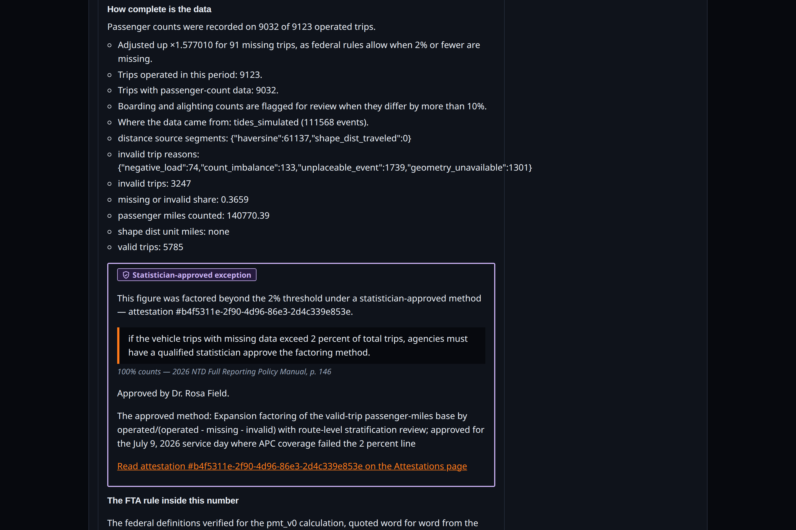
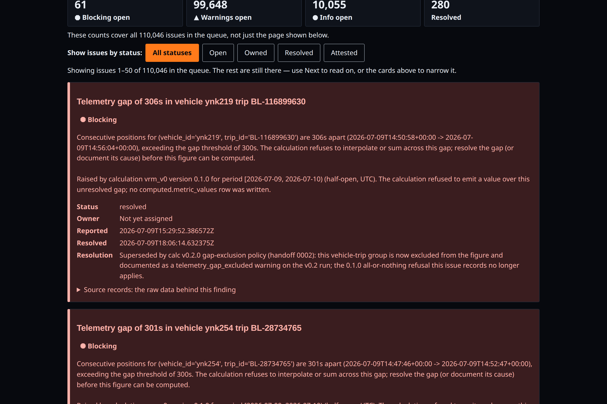

<div align="center">

# 🚌 Headway

**The open-source transit data platform where every number can prove itself.**

[](https://github.com/headway-transit/headway/actions/workflows/ci.yml)
[](LICENSE)
[](https://github.com/headway-transit/headway/releases)

</div>

Headway ingests a transit agency's operational data — GTFS and GTFS-Realtime feeds, TIDES passenger counts, and more — into an immutable, replayable log, normalizes it into one open canonical model, and computes the figures agencies report to the FTA's **National Transit Database**: vehicle revenue miles and hours, unlinked passenger trips, vehicles operated in maximum service.

What makes it different is one design decision applied everywhere: **radical provenance.**

- Every reported figure is computed by **deterministic, versioned, unit-tested calculation logic** — with the federal regulation it implements *quoted, page-cited, and displayed inside the number*.
- Every figure can be **walked back through an explicit lineage graph** to the content-addressed raw records that produced it.
- Data gaps are never papered over: the platform **refuses to report over unresolved gaps**, and every exclusion becomes an owned, documented data-quality issue — because an unexplained gap becomes a finding in an FTA triennial review.
- AI features assist (anomaly flags, triage, drafting) but **AI never computes a reported number**; every AI output cites its sources, is labeled, and requires human review — enforced by types and a CI grounding gate, not by policy documents.
- Certification is **informed consent, mechanized**: the signing screen shows exactly what a signature covers, and won't arm while blocking issues are open or simulated data is unacknowledged.

## See it

| The dashboard — every figure exactly as computed | The live map — your own streets, your own data |
| --- | --- |
|  |  |

| Boardings to review — where a person decides | How this number was made |
| --- | --- |
| ![The revenue review queue: one boarding waiting on a decision, showing the vehicle, service day, rider count, and that the bus was not logged into a run — so there is no route, trip or stop on the record. Under "Headway's own reading" it says it will not guess this one, because the federal manual has no rule that tells prep apart from a catch-up bus; only a person who knows what dispatch did that day can say. A banner states the boarding is held out of the ridership figure while it waits: not counted, and not thrown away](docs/images/review-queue.png) |  |

| The certification cockpit | The data-quality queue |
| --- | --- |
|  |  |

## Quickstart

On a fresh Linux box, run the guided installer:

```sh
./install/install.sh
```

It checks the machine, generates strong secrets, brings the stack up, applies migrations, and creates your first administrator — explaining every step and every failure in plain language (`--check` for a no-changes dry run; [full guide](install/README.md)). Updating later is two commands, every image signature-verified before anything switches, your data untouched, and no phoning home — ever: [`docs/updating.md`](docs/updating.md). Sizing a box or VM first? [`docs/sizing.md`](docs/sizing.md) has measured numbers, not vendor optimism. Prefer by hand? [`deploy/compose/`](deploy/compose/): copy `.env.example`, set three passwords, `docker compose up -d`.

Then **connect your data** — GTFS feeds, passenger counts, or exports from your existing databases: [`docs/connecting-your-data.md`](docs/connecting-your-data.md). Point it at any agency's public GTFS/GTFS-RT feeds and watch real figures assemble with full provenance in minutes.

### For analysts

Your planning and data teams can work in the tools they already use: a typed [Python client](clients/python/) whose DataFrames always carry provenance columns, [example notebooks executed against a live stack](notebooks/), and a least-privilege read-only SQL role — setup in [`docs/analyst-access.md`](docs/analyst-access.md). Explore and compute freely: nothing computed outside Headway's calculation library (services/calc) can ever become a reported figure. Only the calculation library writes computed.metric_values, and the walls are structural database CHECKs, not policy.

## What runs where

Everything runs on commodity open-source infrastructure — PostgreSQL + TimescaleDB, Apache Kafka, MinIO, Prometheus/Grafana — on one Linux box a small agency can afford. Gov-cloud deployments run the *identical* signed artifacts under Kubernetes. **If a feature only works in the cloud, it is rejected.**

| Path | Contents |
| --- | --- |
| `contracts/` | The wire contract — the published integration surface vendors build against (ADR-0006) |
| `services/ingestion/` | Go connector runtime: GTFS static, GTFS-Realtime, TIDES (file drop + authenticated push) |
| `services/transform/` | Python normalization into the canonical model, with per-row lineage |
| `services/calc/` | The deterministic calculation library + [`REGULATORY_TRACKER.md`](services/calc/REGULATORY_TRACKER.md) — every calc version cites the manual page it implements |
| `services/api/` | FastAPI: auth, machine keys, audited certification, webhooks, public transparency endpoint |
| `services/ai/` | The grounding-gated AI layer — citation-verified or it doesn't ship |
| `web/` | React UI: receipts, lineage walks, dashboards, the certification cockpit (WCAG 2.1 AA) |
| `db/` | Migrations incl. the immutable raw registry, lineage graph, append-only audit |
| `deploy/` | Compose (source of truth) + Helm from the same images; signed releases with SBOMs |
| `docs/` | [ADRs](docs/adr/), [handoffs](docs/handoffs/), [agency guides](docs/connecting-your-data.md), [supply chain](docs/supply-chain.md) |

## How this project is governed

Headway is built to resist single-vendor capture — see [`GOVERNANCE.md`](GOVERNANCE.md). Contributions welcome under [`CONTRIBUTING.md`](CONTRIBUTING.md) (DCO, Apache-2.0); security reports via [`SECURITY.md`](SECURITY.md). The engineering constitution — eight non-negotiable constraints every change is reviewed against — lives in [`.claude/roles/_SHARED_CONSTRAINTS.md`](.claude/roles/_SHARED_CONSTRAINTS.md), and every architectural decision is a public ADR.

**Status: alpha.** The pipeline is live-verified end-to-end against real transit feeds; the calculations are definition-verified against the 2025/2026 NTD Policy Manuals with all divergences documented; no figure is yet certified for actual federal submission — and the platform itself will tell you exactly that, on every screen that shows one.

## Support

Community support via [GitHub issues and discussions](SUPPORT.md); commercial support and agency onboarding via **Bekus Solutions** — support@bekus.co ([details](SUPPORT.md)).

## License

Apache License 2.0 — see [LICENSE](LICENSE) and [NOTICE](NOTICE).
